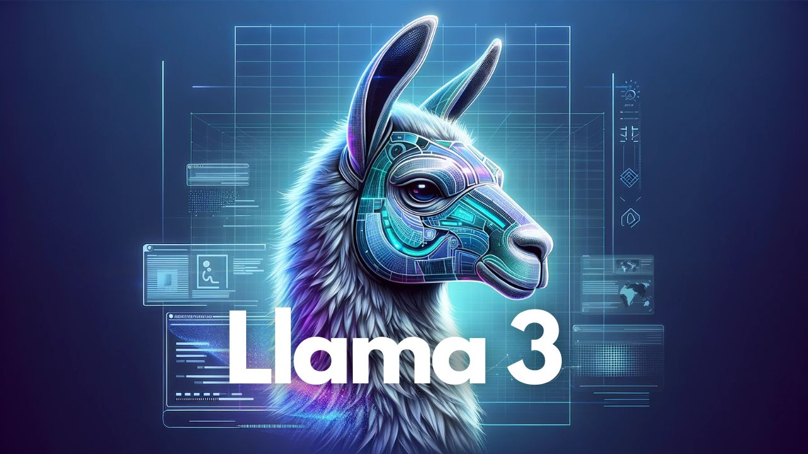

# scrappyLLM

A from-scratch implementation of a character-level language model in PyTorch, inspired by the LLaMA (Large Language Model Meta AI) architecture.



## About The Project

This project is a hands-on exploration into building a modern transformer-based language model from the ground up using PyTorch. The architecture is inspired by Meta's LLaMA, incorporating key components like:

*   **Rotary Positional Embeddings (RoPE)**: For injecting positional information in a relative and efficient manner.
*   **RMS Normalization**: A simpler and more efficient normalization technique.
*   **SwiGLU Activation**: A variant of the Gated Linear Unit for improved performance.
*   **Multi-Head Attention**: The core of the transformer model.

The model is trained on the "Tiny Shakespeare" dataset to generate character-level text in a similar style.

## Progress
![[10,000epochs]](./Assets/Screenshot%202025-11-26%20at%208.26.55 PM.png)

- After 10,000 epochs, the model can reproduce most of the shakespeare text.
- Further training without more data could result in overfitting
- Training Loss improvement: 3.779 -> 1.303
- Validation Loss improvement: 3.803 -> 1.548

## Getting Started

Follow these steps to get the project running on your local machine.

### Prerequisites

*   Python 3.x
*   `pip` and `venv`

### Installation & Setup

1.  **Clone the repository:**
    ```sh
    git clone <repository-url>
    cd scrappyLLM
    ```

2.  **Create and activate a virtual environment:**
    ```sh
    python3 -m venv venv
    source venv/bin/activate
    ```

3.  **Install the required packages:**
    ```sh
    pip install -r requirements.txt
    ```

4.  **Download the dataset:**
    The `importData.py` script will download the Tiny Shakespeare dataset into the `data/` directory.
    ```sh
    python3 importData.py
    ```

## Usage

To train the model and generate text, run the main script:

```sh
python3 llama.py
```

The script will:
1.  Load and preprocess the dataset.
2.  Initialize the `LlamaModel`.
3.  Train the model for the number of epochs specified in `MASTER_CONFIG`.
4.  Print validation loss and ETA during training.
5.  Generate and print sample text after training is complete.
